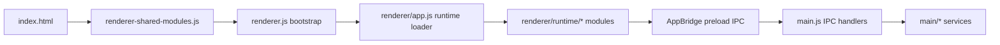

# Project Manager Pro

<!-- markdownlint-disable MD033 -->
<p align="center">
  
</p>

<p align="center">
  <strong>Desktop project workflow hub for Windows-focused teams and solo builders.</strong><br />
  <sub>Secure Electron architecture for project operations, Git/GitHub workflows, diagnostics telemetry, updates, and extensibility.</sub>
</p>

<p align="center">
  <a href="#quick-start"></a>
  <a href="#architecture"></a>
  <a href="#diagnostics-log-viewer"></a>
  <a href="#registration-and-licensing"></a>
</p>

<p align="center">
  
  
  
  
  
</p>

<p align="center">
  <code>Secure IPC</code>
  <code>Diagnostics-First</code>
  <code>Operation Queue</code>
  <code>Workspace Snapshots</code>
  <code>Modular Renderer Runtime</code>
</p>
<!-- markdownlint-enable MD033 -->

---

## Table of Contents

- [Overview](#overview)
- [Feature Surface](#feature-surface)
- [Quick Start](#quick-start)
- [Architecture](#architecture)
- [Diagnostics Log Viewer](#diagnostics-log-viewer)
- [Security Model](#security-model)
- [Registration and Licensing](#registration-and-licensing)
- [Update System](#update-system)
- [Keyboard Shortcuts](#keyboard-shortcuts)
- [Project Structure](#project-structure)
- [Scripts](#scripts)
- [Testing and Quality Gates](#testing-and-quality-gates)
- [Troubleshooting](#troubleshooting)
- [Related Documents](#related-documents)
- [License](#license)

---

## Overview

Project Manager Pro is a real-world Electron desktop application that focuses on:

- secure desktop architecture patterns
- practical project and repository workflows
- modular renderer and service-oriented main process design
- robust telemetry and diagnostics for fault analysis

This repository is intentionally engineered as an application codebase, not a UI shell demo.

---

## Feature Surface

### Workspace and Project Operations

- Create, import, export, rename, and delete projects
- Workspace path management with safe path validation
- Project templates and scaffold generation
- Recent projects and favorites flows
- Indexed workspace search with persisted index cache

### Git and GitHub

- Git status, commit, pull, push, fetch, sync, log
- Branch operations, tags, remotes, stash, reset, revert, clean
- Hunk-level diff and apply workflows
- Merge conflict listing and resolve/abort/continue helpers
- GitHub authentication and upload pipeline with progress telemetry

### Diagnostics and Reliability

- Dedicated Diagnostics view in Help menu
- Live stream of app log entries from main process
- Smart fault detection and recurrence summary
- Search, level/source filters, fault-only mode, autoscroll
- Copy/export/open-log-folder/clear-session actions
- Renderer fault capture (`error` + `unhandledrejection`) with rate limiting

### Automation

- Operation queue for long-running tasks
- Queue cancellation and retry support
- Workspace snapshots (save and restore)
- Task profiles per project
- Search index build and query APIs

### Extensibility and UX

- Extension manager with install/uninstall/enable/disable
- Theme extensions with dynamic CSS loading
- Command palette and keyboard-first navigation
- Built-in documentation view with searchable sections
- Custom title bar, tray integration, and status bar telemetry

### Security and Product Access

- Strict preload IPC allowlist bridge
- Command, path, and Git input validation
- External navigation guards and blocked webviews
- Sanitized settings persistence
- Encrypted license storage and integrity verification
- Pro feature gating with registration UI flows

---

## Quick Start

### Prerequisites

- Node.js 18+
- npm
- Windows for full packaging parity (runtime code includes macOS/Linux terminal fallbacks)

### Install

```bash
npm install
```

### Run in Development

```bash
npm start
```

### Safety Test Suite

```bash
npm run test:safety
```

### Lint

```bash
npm run lint
```

---

## Architecture

### High-Level Flow



### Main Process Composition

`main.js` orchestrates windows, app lifecycle, IPC handlers, feature gating, and service wiring.

| Service | Responsibility |
| --- | --- |
| `main/logger.js` | Structured logging, fault detection, history filtering, live listeners |
| `main/update-manager.js` | Update channels, release checks, download/install flow, GitHub fallback |
| `main/workspace-services.js` | Snapshots, task profiles, indexed search, persistence |
| `main/operation-queue.js` | Durable async queue with cancel/retry and persisted snapshots |
| `main/project-discovery-service.js` | Workspace scanning, project typing, cache/inflight dedupe |
| `main/license/license-manager.js` | Registration, encrypted storage, fingerprint checks, rate limiting |
| `main/settings/app-settings.js` | Settings defaults and strict sanitization |
| `main/window-security-manager.js` | Navigation restrictions, permission denial, external URL safety |
| `main/windows-command-utils.js` | Windows command invocation helpers and guards |
| `main/vscode-launcher-service.js` | VS Code launcher resolution and cached capability checks |
| `main/renderer-file-service.js` | Renderer-related file/settings operations with validation |

### Renderer Modular Runtime

Renderer runtime is split across ordered classic-script modules loaded by `renderer/app.js`.

Load order:

1. `renderer/runtime/shared/00-environment-state-services.js`
2. `renderer/runtime/shared/10-ui-shell-modal-toast.js`
3. `renderer/runtime/core/00-foundation-and-startup.js`
4. `renderer/runtime/core/10-shell-update-queue.js`
5. `renderer/runtime/core/20-navigation-status-about.js`
6. `renderer/runtime/core/30-settings-model-ui.js`
7. `renderer/runtime/git/00-git-workflows.js`
8. `renderer/runtime/git/10-github-upload-and-tabs.js`
9. `renderer/runtime/extensions/00-extensions-catalog-and-settings.js`
10. `renderer/runtime/extensions/10-command-modals-shortcuts.js`
11. `renderer/runtime/projects/00-project-selection-and-favorites.js`
12. `renderer/runtime/projects/10-projects-and-recent-view.js`
13. `renderer/runtime/projects/20-github-auth-and-delete-dialogs.js`
14. `renderer/runtime/projects/30-tips-and-scroll-effects.js`

See `renderer/runtime/README.md` for runtime safety rules and order guarantees.

---

## Diagnostics Log Viewer

The diagnostics experience is a dedicated view (`diagnostics-view`), not a modal.

Access paths:

- Help -> `Diagnostics Log Viewer`
- Shortcut: `Ctrl+Alt+H`

Capabilities:

- Session counters: total, visible, faults, errors, live rate, top source
- Smart summary that identifies burst faults and recurring patterns
- Filters: search text, level, source, fault-only
- Live stream toggle and autoscroll toggle
- Entry detail panel with timestamp/message/context
- Export visible results as JSON
- Copy selected entry to clipboard
- Open log directory and clear in-memory history

Main IPC contract used by the viewer:

- `get-log-history`
- `clear-log-history`
- `open-log-folder`
- `app-log-entry` (live push from main process)

---

## Security Model

### Renderer Boundary

- `preload.js` exposes only `AppBridge.ipc` and selected process metadata
- invoke/receive channels are explicit allowlists
- non-allowlisted channel access throws

### IPC and Command Safety

- Git refs, hashes, remotes, file paths, and workspace paths are validated
- shell command execution is allowlist + pattern based (`parseAllowedRunCommand`)
- settings payloads are sanitized with strict size/type/depth limits

### Window and Navigation Safety

- untrusted `window.open` attempts are denied
- non-local navigation is blocked and optionally redirected to safe external open
- webview attachment is blocked
- permission requests are denied by default session policy

### Telemetry and Fault Reporting

- main process captures `uncaughtException` and `unhandledRejection`
- renderer reports global `error` and `unhandledrejection` events
- diagnostics stream supports fault filtering and context retention

---

## Registration and Licensing

Registration logic is extracted to `main/license/license-manager.js` with focused tests.

Core properties:

- key format utilities in `license-utils.js`
- tier-aware keys (`standard`, `pro`, `enterprise`)
- encrypted local license payload storage
- integrity HMAC to detect tampering
- machine fingerprint binding with grace-period logic
- cooldown and lockout for repeated invalid registration attempts
- masked key presentation in renderer

### Product Key Utilities

Generate keys from CLI:

```bash
# generate one key
npm run generate:key

# generate 10 keys
node scripts/generate-product-key.js 10
```

Run keygen app:

```bash
npm run keygen
```

### Activation Keys

> [!TIP]
> The license/registration component in this repository exists to teach me cryptography and secure-software concepts (key generation, validation, secure storage, integrity checks, and device binding).
> It is not intended to be a real end-user registration, licensing, or monetization system.
> Keys are not sold and should never be sold. All keys below are permanently free for testing and learning.

Copy directly from the text boxes below.

#### Standard Keys

```text
1028-9038-2060-0413
1026-3267-6248-1731
1025-4820-2538-6566
1023-6447-0465-8126
1028-4560-2126-1278
1022-1228-3434-6065
1021-1612-4406-1401
1021-2274-5075-2667
1029-5301-2197-1036
1025-1154-1323-3640
```

#### Pro Keys

```text
2026-7495-0172-7380
2028-9606-7139-8831
2022-6758-5687-6619
2020-3418-5659-4232
2021-9220-5484-5240
2026-1875-5430-0479
2027-4989-7499-3910
2028-8320-3947-0132
2021-1535-4296-0380
2024-3191-8711-7304
```

#### Enterprise Keys

```text
3020-5521-7856-0405
3024-5671-6966-9546
3027-9582-3102-7824
3024-3458-0303-1758
3027-5314-6350-5595
3027-0004-2852-6496
3026-8914-1756-8550
3029-7587-3591-8702
3029-7619-1719-5928
3025-9944-1204-1768
```

---

## Update System

Update provider target:

- [ProjectManagerPro releases](https://github.com/skillerious/ProjectManagerPro/releases)

Update manager behavior:

- channels: `stable`, `beta`, `alpha`
- automatic updater path for packaged builds
- manual GitHub release API fallback when needed
- manual-only upgrade state when feed and release tags diverge
- download and install controls with state broadcast to renderer
- rollback-to-stable check support

Build config source:

- `package.json` -> `build.publish` (`provider: github`, `owner: skillerious`, `repo: ProjectManagerPro`)

---

## Keyboard Shortcuts

Selected shortcuts exposed in the app:

| Shortcut | Action |
| --- | --- |
| `Ctrl+N` | New Project |
| `Ctrl+O` | Open Project |
| `Ctrl+F` | Search (context aware) |
| `Ctrl+,` | Open Settings |
| `F1` | Open Documentation |
| `Ctrl+Shift+P` | Command Palette |
| `Ctrl+Shift+B` | Build Project |
| `Ctrl+Shift+G` | Clone Repository |
| `Ctrl+\`` | Open Terminal |
| `Ctrl+Alt+H` | Diagnostics Log Viewer |
| `Ctrl+Alt+L` | Check for Updates |
| `Ctrl+Alt+K` | Register Product |
| `Alt+1..6` | Primary Sidebar Navigation |
| `Alt+Left / Alt+Right` | View History Navigation |

---

## Project Structure

```text
AppManager/
  main.js
  preload.js
  index.html
  styles.css
  renderer.js
  renderer-log-viewer.js
  renderer-shared-modules.js
  renderer/
    app.js
    runtime/
      README.md
      shared/
      core/
      git/
      extensions/
      projects/
  main/
    logger.js
    update-manager.js
    workspace-services.js
    operation-queue.js
    project-discovery-service.js
    renderer-file-service.js
    window-security-manager.js
    windows-command-utils.js
    vscode-launcher-service.js
    license/
      license-manager.js
    settings/
      app-settings.js
    workspace/
      workspace-utils.js
  scripts/
    generate-product-key.js
  tests/
    security-utils.test.js
    license-utils.test.js
    license-manager.test.js
    operation-queue.test.js
    workspace-services.test.js
    project-discovery-service.test.js
    ipc-contract.test.js
    update-manager.test.js
    config-consistency.test.js
    renderer-contract.test.js
  keygen/
  assets/
```

---

## Scripts

| Script | Purpose |
| --- | --- |
| `npm start` | Start Electron app in development mode |
| `npm run lint` | Run ESLint for main/preload/security/scripts/tests |
| `npm run test:safety` | Run safety and contract focused tests |
| `npm run build-win` | Build Windows installer via electron-builder |
| `npm run dist` | Build distributable artifacts |
| `npm run run-dist` | Alias for `npm run dist` |
| `npm run keygen` | Launch keygen Electron app |
| `npm run build-keygen` | Build packaged keygen app |
| `npm run generate:key` | Generate product keys from script |

---

## Testing and Quality Gates

Run the core suite:

```bash
npm run test:safety
```

Coverage focus areas:

- security validators and command parsing
- preload IPC contract allowlists
- renderer CSP and runtime modularization contract
- license utilities and license manager behaviors
- operation queue persistence and state transitions
- workspace snapshots, task profiles, and index query behavior
- project discovery caching and classification
- update version normalization and fallback logic
- package/version consistency checks

---

## Troubleshooting

### Diagnostics View Is Empty

- Open Help -> Diagnostics Log Viewer
- Ensure `Live Stream` is enabled
- Clear level/source filters
- Trigger an action and refresh

### Need Raw Logs

- In Diagnostics view, click `Open Log Folder`
- Default location is under `%APPDATA%/{app}/logs`

### Update Check Is Not Downloading

- Dev builds use manual release checks by design
- Packaged builds are required for automatic download/install path
- Verify network access to GitHub releases

### Registration Fails Repeatedly

- Ensure key format is `####-####-####-####`
- Avoid rapid retries (cooldown/lockout is enforced)
- If hardware changed, grace period and fingerprint checks may apply

---

## Related Documents

- [Renderer runtime notes](renderer/runtime/README.md)
- [Quick start notes](QUICK_START.md)
- [Setup guide](SETUP_GUIDE.md)
- [Advanced features notes](ADVANCED_FEATURES.md)
- [Implementation summary](IMPLEMENTATION_SUMMARY.md)
- [Integration summary](INTEGRATION_COMPLETE.md)
- [High impact roadmap](HIGH_IMPACT_ROADMAP.md)

---

## License

MIT
