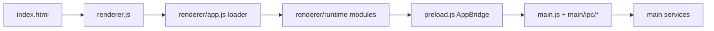

# Project Manager Pro

<p align="center">
  
</p>

<p align="center">
  <strong>Windows-first project workflow control center built with Electron.</strong><br />
  Plan, build, ship, and troubleshoot from one desktop workspace.
</p>

<p align="center">
  <a href="https://github.com/skillerious/ProjectManagerPro/releases"></a>
  
  
  
</p>

<p align="center">
  
</p>

## Why This Project Stands Out

Project Manager Pro is not just a project launcher. It combines:

- workspace and project lifecycle tooling
- full Git/GitHub desktop workflows
- production-style diagnostics and fault triage
- secure IPC boundaries and command guardrails
- update orchestration with release-channel control

The result is a practical desktop app architecture you can use, study, and extend.

---

## What Is New (v2.8.0 - March 14, 2026)

- Added direct **SMTP issue reporting** from the app (no mail-client handoff required).
- Hardened project export against shell injection by moving to argument-based process execution.
- Fixed close-to-tray behavior when users change settings before saving.
- Improved tray icon clarity with proper multi-resolution `.ico` handling on Windows.
- Debounced GitHub upload file search for smoother large-tree interactions.
- Tightened renderer safety by keeping SMTP password and GitHub tokens out of renderer-safe settings.

See full release history in [CHANGELOG.md](CHANGELOG.md).

---

## Feature Surface

| Area | Highlights |
| --- | --- |
| Workspace | Create/import/export projects, favorites, recent projects, workspace snapshots, task profiles |
| Git + GitHub | Status/commit/branch/tag/stash flows, merge helpers, GitHub auth/upload panel, safe command execution |
| Diagnostics | Live log stream, fault-only mode, filtering, export/copy, log-folder open, renderer/main fault capture |
| Updates | `stable` / `beta` / `alpha` channels, GitHub releases fallback, download progress state, rollback-to-stable |
| Extensions + Themes | Install/uninstall/enable/disable, settings per extension, theme extension support |
| Security | IPC allowlists, CSP hardening, strict settings sanitization, guarded external navigation, encrypted token handling |

---

## Quick Start

### Prerequisites

- Node.js 18+
- npm
- Windows (recommended for full packaging/runtime parity)

### Run locally

```bash
npm install
npm start
```

### Quality checks

```bash
npm run lint
npm run test:safety
```

### Build distributables

```bash
npm run build-win
npm run dist
```

---

## Architecture Snapshot



### Main services

- `main/update-manager.js` - release checks, channels, progress state, install flow
- `main/workspace-services.js` - snapshots, task profiles, indexed search
- `main/operation-queue.js` - durable queued operations with cancel/retry
- `main/project-discovery-service.js` - workspace scanning/classification
- `main/license/license-manager.js` - registration and license-state logic
- `main/window-security-manager.js` - navigation and permission hardening
- `main/ipc/*` - focused IPC registrar modules

Renderer runtime details: [renderer/runtime/README.md](renderer/runtime/README.md)

---

## Keyboard-First Workflow

| Shortcut | Action |
| --- | --- |
| `Ctrl+N` | New project |
| `Ctrl+O` | Open project |
| `Ctrl+,` | Open settings |
| `Ctrl+Shift+P` | Command palette |
| `Ctrl+Shift+G` | Clone repository |
| `Ctrl+Alt+H` | Diagnostics log viewer |
| `Ctrl+Alt+L` | Check for updates |
| `Ctrl+Alt+K` | Register product key |

---

## Diagnostics and Support

Diagnostics tools are built-in and designed for fast triage:

- searchable live log stream with source/level filters
- fault recurrence summaries and contextual metadata
- one-click export/copy/open-log-folder actions
- issue report submission via SMTP from the Help flow

---

## Project Layout

```text
AppManager/
  main.js
  preload.js
  index.html
  renderer.js
  styles.css
  main/
    ipc/
    license/
    settings/
    workspace/
    *.js services
  renderer/
    app.js
    runtime/
      core/
      git/
      extensions/
      projects/
      shared/
  tests/
  assets/
  scripts/
```

---

## Security Posture

Key protections implemented in this codebase:

- strict IPC channel allowlists in preload bridge
- command allowlisting and input validation for Git/task execution
- settings sanitization (type/length/depth/range constraints)
- restricted external URL handling and blocked unsafe navigation paths
- renderer-safe settings projection to keep secrets out of UI runtime

---

## Releases

- Latest tags and binaries: <https://github.com/skillerious/ProjectManagerPro/releases>
- Changelog: [CHANGELOG.md](CHANGELOG.md)
- Update metadata configured in `package.json` (`build.publish`)

---

## License

MIT - see [LICENSE](LICENSE).
